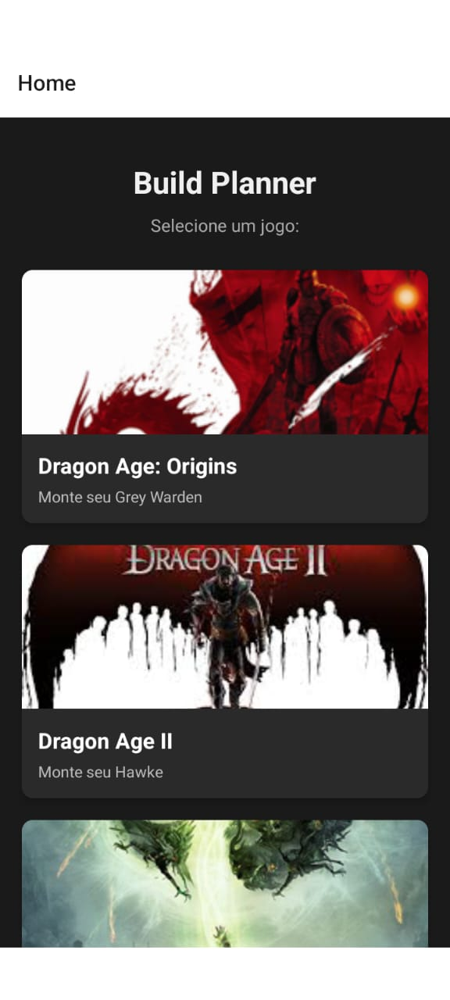
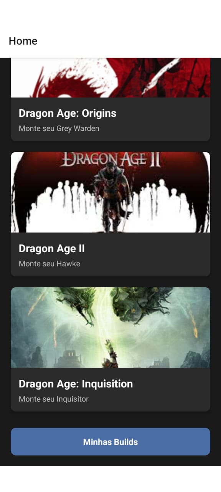
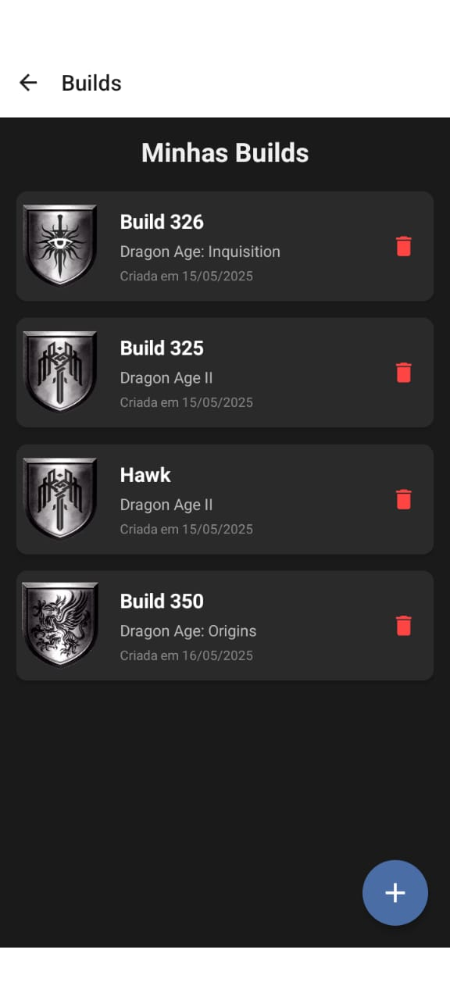
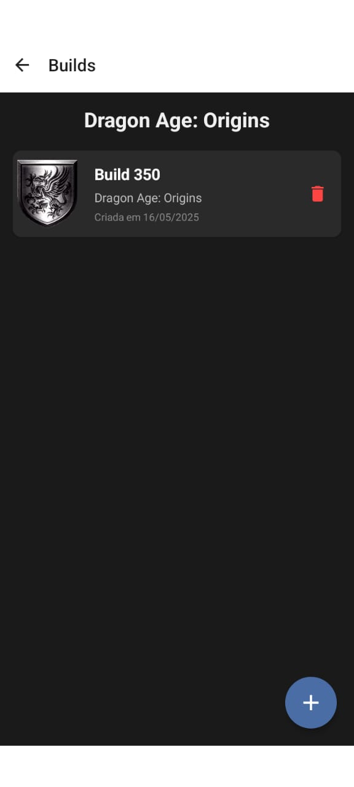
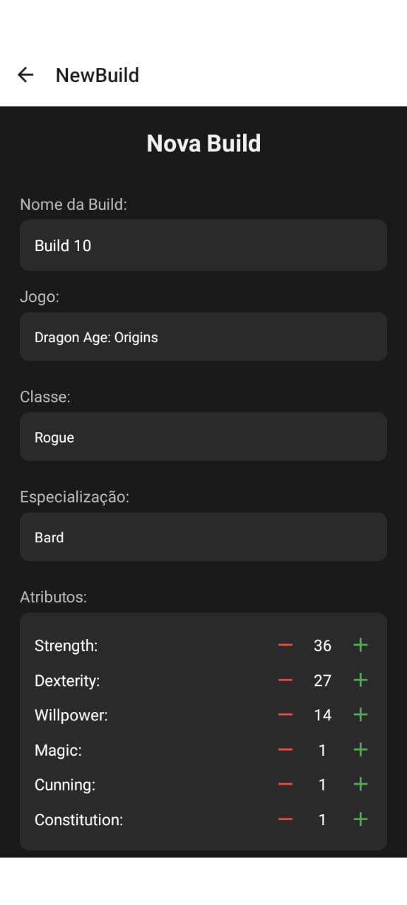
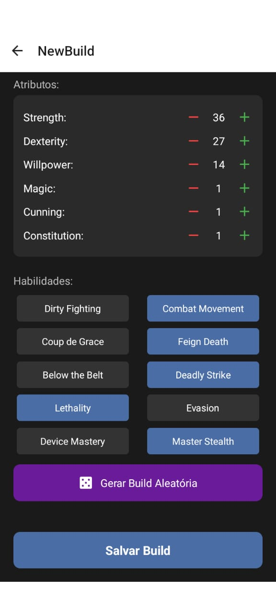
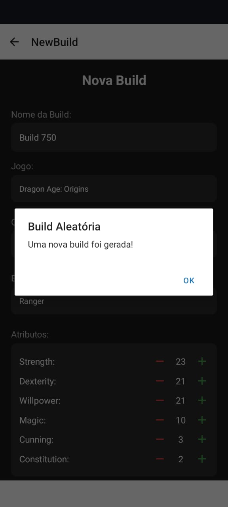
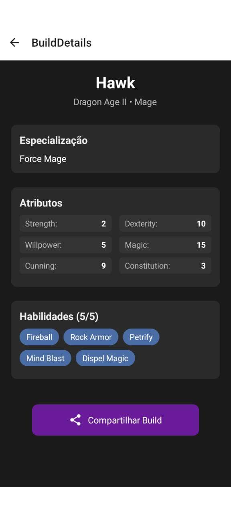
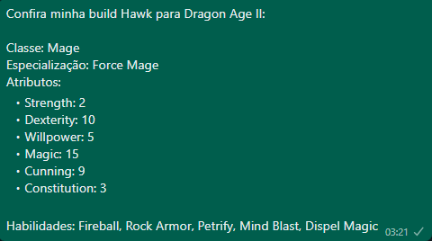

# Build Planner
Computação Móvel
## Sobre
Projeto realizado em React Native com o objetivo de criar e compartilhar builds da série de jogos Dragon Age.
Link do projeto no Expo: https://snack.expo.dev/@kayna2d/build-planner

## Funcionalidades
**Navegação:** Usados os componentes de navegação NavigationContainer e createStackNavigator para explorar as quatro páginas da aplicação.
```
const Stack = createStackNavigator();

export default function App() {
  return (
    <NavigationContainer>
      <Stack.Navigator initialRouteName="Home">
        <Stack.Screen name="Home" component={HomeScreen} />
        <Stack.Screen name="Builds" component={BuildListScreen} />
        <Stack.Screen name="NewBuild" component={BuildEditorScreen} />
        <Stack.Screen name="BuildDetails" component={BuildDetailScreen} />
      </Stack.Navigator>
    </NavigationContainer>
  );
}
```

**Armazenamento:** As informações das builds são armazenadas localmente com funções CRUD que usam o AsyncStorage.
```
import AsyncStorage from '@react-native-async-storage/async-storage';

export const saveBuild = async (builds) => {
  [...]
};

export const getBuilds = async () => {
  [...]
};

export const deleteBuild = async (id) => {
  [...]
};
```

**Home:** Tela de início exibe os jogos disponíveis e um botão que leva à lista de todas as builds.


<br />

**Lista de Builds:** Segunda tela mostra as todas as builds ou filtradas por jogo (depende da opção selecionada em home)



<br />

**Tela de Edição:** Apresenta um formulário a ser preenchido com os dados da build.




<br />

**Função Aleatória:** Botão que preenche o formulário com dados aleatórios para um jogo rápido, alternativamente, a função pode ser ativada ao chacoalhar o aparelho graças ao acelerômetro.


<br />

**Tela de detalhes:** Tela apresenta os detalhes da build selecionada na lista e permite o compartilhamento das informações por texto.




<br />
